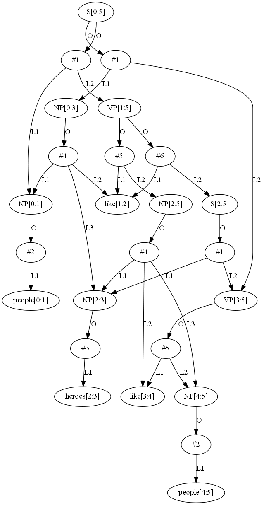
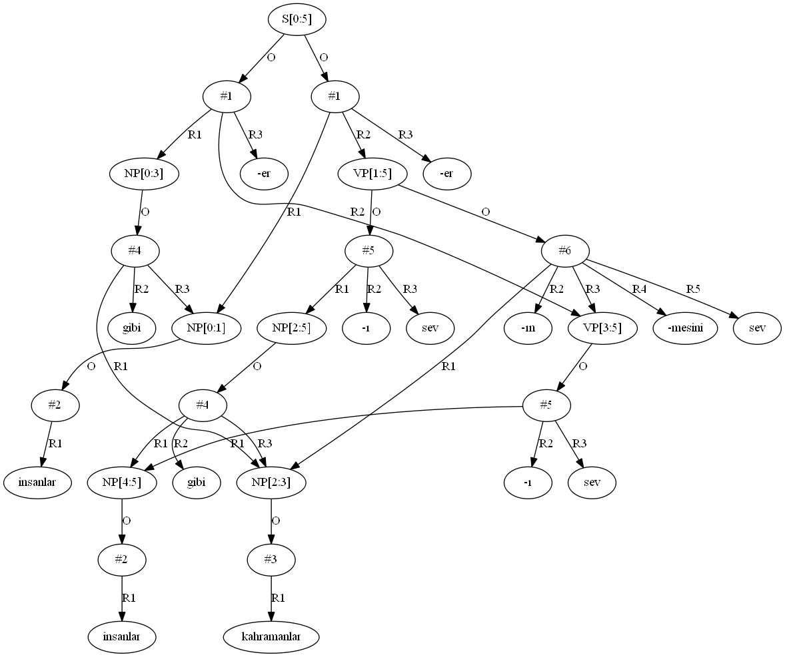

# NLPParser
* Natural Language Parser which handles ambiguous grammars
* Unification Engine which handles unification of features
* Translation Engine for Syntax-Based Translation of Natural Languages

It can be used to parse and visualize highly ambigous grammars:
```
S -> NP VP
NP -> people | heroes
NP -> NP like NP
VP -> like NP
VP -> like S
```
Consider following input sentence to be parsed:
```
people like heroes like people
```
Above grammar can be parsed, and shared&packed parse forest can be visualized using the following code: 
```cpp
try {
	Parser parser;
	parser.load_grammar("test/ambig.grm"); // load the grammar from the file
	parser.compile(); // create DFA and other internal tables from the grammar

	parser.parse("people like heroes like people"); // parse the sentence
	parser.print_parse_dot_all("ambig_parse.dot"); // write parse tables to a file in a GraphViz format
	auto tree = parser.make_tree(true); // generate parse tree from internal tables
	dot_print("ambig_tree.dot", tree); // write parse tree to a file in a GraphViz format
}
catch (GrammarError&) { // input grammar cannot be parsed
	cout << "GrammarError" << endl;
}
catch (ParseError&) { // sentence cannot be parsed
	cout << "ParseError" << endl;
}
```
The output would be:


Note that there are two type of nodes in the parse tree:
* Nonterminals, of the format: NonTerminal[StartPosition:EndPosition]
* Rules, of the format: #RuleNumber

After pruning unproductive nodes, and normalizing into a tree format, the parse tree would be like:



By slightly augmenting the grammar, it can be used for syntax-based translation:
```
S -> NP VP : NP VP -er
NP -> people : insanlar
NP -> heroes : kahramanlar
NP -> NP-1 like NP-2 : NP-2 gibi NP-1 
VP -> like NP : NP -ı sev
VP -> like NP VP : NP -ın VP -mesini sev
```
And the same input sentence can be translated using the following code:
```cpp
try {
	Parser parser;
	parser.load_grammar("test/ambig_trans.grm"); // load the grammar from the file
	parser.compile(); // create DFA and other internal tables from the grammar

	parser.parse("people like heroes like people"); // parse the sentence

	auto tree = parser.make_tree(true); // generate parse tree from internal tables
	tree = parser.translate_tree(tree, true); // translate the tree
	dot_print("ambig_trans_tree.dot", tree, true, true); // write translated parse tree to a file in a GraphViz format
	for (auto& s : enumerate(tree)) // enumerate all possible output sentences
		cout << s << endl;
}
catch (GrammarError&) { // input grammar cannot be parsed
	cout << "GrammarError" << endl;
}
catch (ParseError&) { // sentence cannot be parsed
	cout << "ParseError" << endl;
};
}
```
The translated parse tree would be like:



And enumeration of all possible output sentences are:
```
kahramanlar gibi insanlar insanları sever
insanlar insanlar gibi kahramanları sever
insanlar kahramanların insanları sevmesini sever
```

