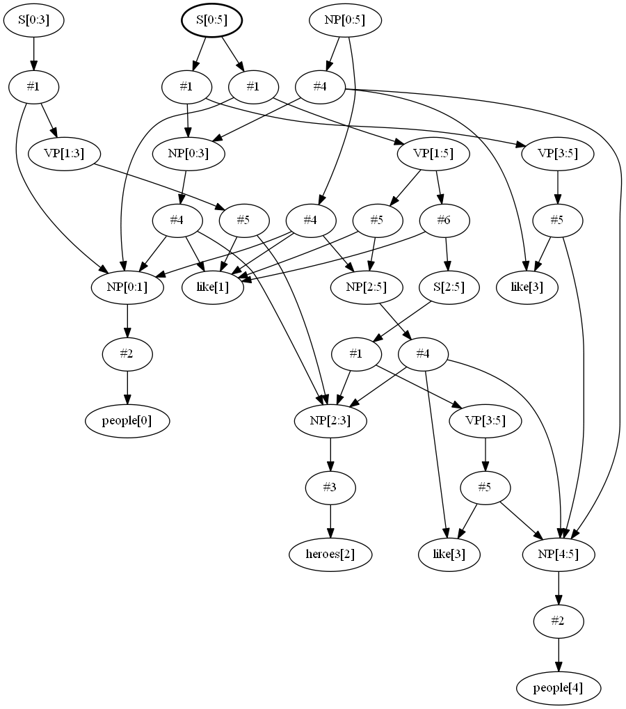

# NLPParser
A GLR Parser for Natural Language Processing and Translation

It can be used to parse and visualize highly ambigous grammars:

	S -> NP VP
	NP -> people | heroes
	NP -> NP like NP
	VP -> like NP
	VP -> like S

Above grammar can be parsed, and shared&packed parse forest can be visualized using the following code: 

```cpp
	Parser parser;
	parser.load_grammar("test/ambig.grm");
	parser.compile();
	try {
		parser.parse("people like heroes like people");
		ofstream parse("ambig_parse.dot");
		parser.print_parse_dot_all(parse);
	}
	catch (UnifyError&) {
		cout << "UnifyError" << nl;
	}
	catch (ParseError&) {
		cout << "ParseError" << nl;
	}
```
The output would be:



* Natural Language Parser which handles ambiguous grammars
* Unification Engine which handles unification of features
* Translation Engine for Syntax-Based Translation of Natural Languages
